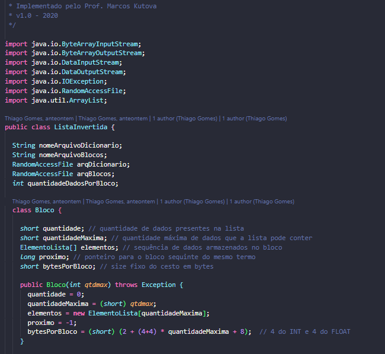
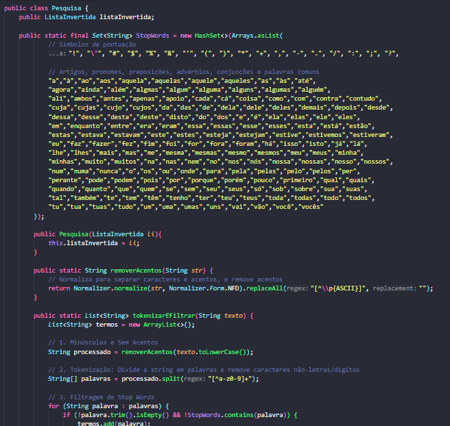
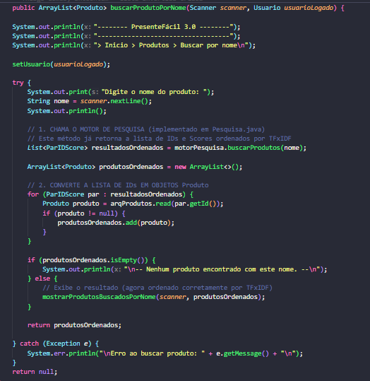
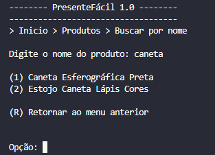
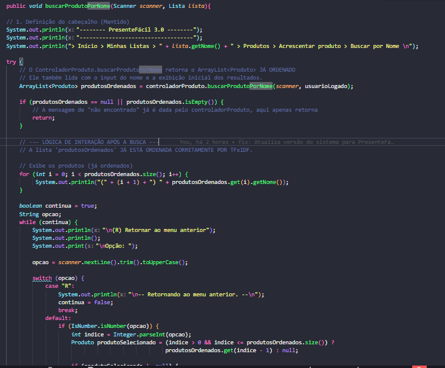
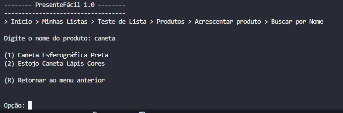
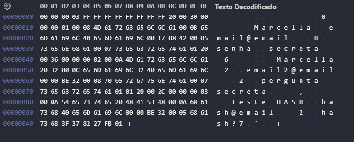

  

<h1 align="center">PONTIFÍCIA UNIVERSIDADE CATÓLICA DE MINAS GERAIS</h1>
<h3 align="center">Instituto de Ciências Exatas e de Informática</h3>
<h3 align="center">Curso de Ciência da Computação</h3>

 

# Relatório Trabalho Prático 03

## Algoritmos e Estruturas de Dados III

Este relatório descreve a terceira parte do Trabalho Prático da disciplina de AEDS III.

 

### Autores

* **Bernardo Ladeira Kartabil**
    * `bernardo.kartabil@sga.pucminas.br`
* **Marcella Santos Belchior**
    * `marcella.belchior@sga.pucminas.br`
* **Thiago Henrique Gomes Feliciano**
    * `1543790@sga.pucminas.br`
* **Yasmin Torres Moreira dos Santos**
    * `yasmin.santos.1484596@sga.pucminas.br`

-----

### **Resumo**

O projeto "PresenteFácil" é um sistema de gerenciamento de listas de presentes, implementado em Java, que utiliza estruturas de dados avançadas para persistência e indexação. Este relatório detalha as funcionalidades implementadas no Trabalho Prático 03 (TP03), com foco na criação de um **Índice Invertido** para permitir buscas textuais por produtos. A nova funcionalidade implementa o cálculo de relevância **TF-IDF** (Term Frequency-Inverse Document Frequency) para ordenar os resultados da busca, melhorando a experiência do usuário. Adicionalmente, foi implementada uma melhoria de segurança no armazenamento da resposta secreta do usuário, utilizando uma função **Hash**, além das correções do feedback do TP2.

-----

## Sumário

1.  [INTRODUÇÃO](#1-introdução)
2.  [DESENVOLVIMENTO](#2-desenvolvimento)
    * [2.1 Estruturas de Dados e Persistência](#21-estruturas-de-dados-e-persistência)
3.  [CHECKLIST DE REQUISITOS](#3-checklist-de-requisitos)
    * [3.1 Índice invertido](#31-índice-invertido)
    * [3.2 Busca de produtos - Manutenção](#32-busca-de-produtos---manutenção)
    * [3.3 Busca de produtos - Acrescentando à lista](#33-busca-de-produtos---acrescentando-à-lista)
    * [3.4 Compilação](#34-compilação)
    * [3.5 Sistema completo e funcional](#35-sistema-completo-e-funcional)
    * [3.6 Originalidade do trabalho](#36-originalidade-do-trabalho)
    * [3.7 "Extra" - Resposta armazenada em Hash](#37-extra---resposta-armazenada-em-hash)
    * [3.8 "Extra" - Feedback TP2](#37-extra---feedback-tp2)
4.  [CONCLUSÃO](#4-conclusão)
5.  [REFERÊNCIAS](#5-referências)

-----

## 1. INTRODUÇÃO

A terceira etapa do projeto "PresenteFácil" expande as funcionalidades de gerenciamento de produtos ao introduzir um sistema de busca textual. Nos trabalhos anteriores (TP01 e TP02), o sistema focava no CRUD (Create, Read, Update, Delete) de usuários, listas e produtos, utilizando estruturas como Árvore B+ e Hash Extensível para indexação e acesso rápido.

O objetivo principal deste TP03 é implementar uma **busca por palavras-chave** (termos) contidas nos nomes dos produtos. Para isso, foi utilizada a estrutura de dados **Índice Invertido** (`ListaInvertida.java`), fornecida pela disciplina, para mapear termos às suas ocorrências. O sistema calcula a relevância dos produtos encontrados usando o algoritmo **TF-IDF**, garantindo que os resultados mais pertinentes (aqueles que melhor combinam com os termos da busca) apareçam primeiro.

## 2. DESENVOLVIMENTO

O desenvolvimento foi centrado na integração da `ListaInvertida` com o `ControladorProduto` e o `ControladorListaProduto`. A classe `Pesquisa.java` foi criada para centralizar a lógica de busca, o pré-processamento de texto (tokenização, remoção de stop words, normalização de minúsculas e acentos) e o cálculo de relevância $\text{TF} \times \text{IDF}$.

 

  

    
    <em>Figura 1: Trecho da classe : ListaInvertida.java.</em>
  

    
  

    
    <em>Figura 2: Trecho da classe : Pesquisa.java.</em>
  

 

### 2.1 Estruturas de Dados e Persistência

O sistema agora utiliza três estruturas principais de indexação, todas persistidas em arquivos binários na pasta `/data`:

* **Árvore B+ (TP02):** Usada para indexar o GTIN-13 dos produtos, permitindo buscas rápidas por chave primária.
* **Hash Extensível (TP02):** Usado para indexar o e-mail dos usuários, garantindo acesso direto no login.
* **Índice Invertido (TP03):** Implementado para indexar os termos (palavras) dos nomes dos produtos. Esta estrutura é persistida nos arquivos `dicionario.db` e `blocos.db`.

Ao cadastrar ou atualizar um produto, seu nome é processado pela classe `Pesquisa`: o texto é convertido para minúsculas, os acentos são removidos, *stop words* são filtradas, e o TF (Frequência do Termo) é calculado. O par `(ID_Produto, TF)` é então armazenado na lista invertida correspondente a cada termo.

## 3. CHECKLIST DE REQUISITOS

### 3.1 O índice invertido com os termos dos nomes dos produtos foi criado usando a classe ListaInvertida?

**Sim.** A classe `ListaInvertida.java`, fornecida pelo professor, foi utilizada como base para a indexação dos termos dos nomes dos produtos.

### 3.2 É possível buscar produtos por palavras no menu de manutenção de produtos?

**Sim.** No menu principal de "Produtos", há uma opção para "Buscar por Nome". Esta funcionalidade utiliza o motor de busca $\text{TF} \times \text{IDF}$ (implementado na classe `Pesquisa.java`) e exibe os resultados ordenados por relevância.

 

  

    
    <em>Figura 3: Trecho da classe : ControladorProduto.java - Buscar por Nome.</em>
  

    
  

    
    <em>Figura 4: Exemplo de busca por relevância - terminal - Menu Produtos.</em>
  

 

### 3.3 É possível buscar produtos por palavras na hora de acrescentá-los às listas dos usuários?

**Sim.** Quando o usuário está gerenciando uma lista específica e escolhe "Acrescentar produto", ele tem a opção "Buscar produtos por nome". Esta tela reutiliza o mesmo motor de busca $\text{TF} \times \text{IDF}$ para encontrar e adicionar o produto desejado, garantindo a ordenação por relevância.

 

  

    
    <em>Figura 3: Trecho da classe : ControladorListaProduto.java - Buscar por Nome.</em>
  

    
  

    
    <em>Figura 6: Exemplo de busca por relevância - terminal - Menu Listas.</em>
  

 

### 3.4 O trabalho compila corretamente?

**Sim.** O projeto compila sem erros.

### 3.5 O trabalho está completo e funcionando sem erros de execução?

**Sim.** O sistema está funcional, incluindo as operações de CRUD dos TPs anteriores e a nova busca por $\text{TF} \times \text{IDF}$. O sistema opera sem erros de execução, mas foi identificado um pequeno erro de cálculo na relevância do índice invertido, que *ocasionalmente* lista um produto irrelevante (com score zero) nos resultados da busca, cuja causa raiz não foi localizada.

  
   
  <em>Figura 7: Exemplo de causa de erro.</em>

### 3.6 O trabalho é original e não a cópia de um trabalho de outro grupo?

**Sim.** O trabalho foi desenvolvido integralmente pelos autores listados.

### 3.7 "Extra" - Resposta armazenada em Hash

**Sim.** Como uma melhoria de segurança obrigatória, a resposta da pergunta secreta do usuário, que antes era armazenada em texto simples, agora é armazenada como um **Hash** (utilizando `String.hashCode()`). A verificação durante a reativação da conta agora compara os *hashes* (valores inteiros), e não mais o texto simples, aumentando a segurança dos dados do usuário.

  
   
  <em>Figura 8: Exemplo armazeamento - Hex Editor ( a resposta depois da última pergunta( hash?)) do usuário teste da implementação. Os usuários acima mostram as respostas antes da implementação de armazenamento. </em>

## 4. CONCLUSÃO

O Trabalho Prático 03 permitiu aprofundar o conhecimento em estruturas de dados de indexação textual. A implementação do Índice Invertido e do $\text{TF} \times \text{IDF}$ foi desafiadora, mas essencial para criar uma funcionalidade de busca moderna e eficiente. A integração dessa nova estrutura com as já existentes (Árvore B+ e Hash) demonstra a complexidade e a robustez de um sistema de gerenciamento de dados completo.

## 5. REFERÊNCIAS

Conforme solicitado, utilizamos o  código-fonte da classe `ListaInvertida.java`, fornecida pelo professor, que serviu de base para a implementação do índice.

